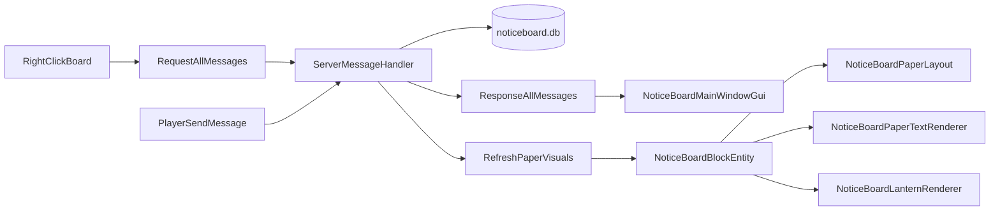

# Development

[← README](../README.md) · [Player guide](player-guide.md) · [Configuration](configuration.md)

Build, source layout, and runtime architecture for contributors.

## Build

**Requirements**

- Vintage Story install; set `VINTAGE_STORY` to its path ([Directory.Build.props](../Directory.Build.props) defaults to `/opt/vintagestory`)
- .NET: project TFM `net10.0-windows7.0` ([NoticeBoard.csproj](../NoticeBoard/NoticeBoard.csproj))
- Game assemblies from `$(VINTAGE_STORY)`; compile-only NuGet `CraluminumMods.VintageStory.AttributeRenderingLibrary` **3.1.5** with `PrivateAssets="all"` (runtime ARL is still the **3.2.0** Mods zip)

**Package**

```bash
./build.sh          # Linux/macOS
./build.ps1         # Windows
```

Runs Cake ([ZZCakeBuild/Program.cs](../ZZCakeBuild/Program.cs)): validate JSON → `dotnet publish` → zip `Releases/noticeboard_<version>.zip` (version from [modinfo.json](../NoticeBoard/modinfo.json)).

**Install (optional)**

`./install.sh` / `./install.ps1` copy `Releases/noticeboard` into the Vintage Story Mods folder (`VINTAGE_STORY_DATA/Mods` or the platform default).

**Debug**

[launchSettings.json](../NoticeBoard/Properties/launchSettings.json) and [.vscode/launch.json](../.vscode/launch.json): Client/Server profiles launch Vintage Story with `--addModPath` pointing at `bin/$(Configuration)/Mods`. In the IDE, pick **Vintage Story Client** and start debugging (F5). That Debug build is what Hot Reload patches. Game install path is `noticeboard.vintageStoryPath` in [.vscode/settings.json](../.vscode/settings.json) (same default as [Directory.Build.props](../Directory.Build.props): `/opt/vintagestory`).

Disable or move `~/.config/VintagestoryData/Mods/noticeboard` while using F5, or the game loads both the installed copy and the debug copy. `./install.sh` is still the way to refresh the Mods-folder copy. Asset-only tweaks in a running world: `.reload textures`, `.reload shapes`, `.reload lang`. World reload without quitting: `CTRL+F1`. C# Hot Reload cannot always apply signature or new-type changes; rejoin or restart the client then.

On Linux, a breakpoint may keep the mouse captured. Wiki workaround: `setxkbmap -option grab:break_actions`, then `xdotool key XF86Ungrab`.

**Other notes**

- No CI in this repo.
- Pinned extra dependency in `modinfo.json`: `attributerenderinglibrary` **3.2.0** (game stays `"game": ""`).
- `#if DEBUG` runs `NoticeBoardPaperLayout` self-checks on client start (permits, pinned/auto, tack, attachment `pinY`, `pinLayer`, `PickSheetAt`).

## Source tree

```
NoticeBoard/
  NoticeBoardModSystem.cs
  modinfo.json
  assets/noticeboard/   blocktypes, recipes, lang, fonts, shapes, sounds, patches
  src/Config            BoardPermissionMode
  src/Database          SQLiteDatabase (file + schema), SQLiteHandler (queries)
  src/Events            ClientMessageHandler, ServerMessageHandler
  src/Packets           ProtoBuf DTOs, channel noticeboard
  src/NoticeBoard       Block, BlockEntity, MessageVisualData
  src/Gui               main window (Messages/Settings partials), composer, themes, ink button, procedural paper row
  src/Rendering         PaperSize, layout, Cairo text, lantern IRenderer, PaperPinController, NoticeBoardPreviewOverlay, sway
  src/Utils             FontManager, Proximity, dates, positions
```

## Runtime flow



- **Channel:** `noticeboard` (registered in `NoticeBoardModSystem.Start`)
- **Client handlers:** `ResponseAllMessages` (open/refresh GUI), `ResponseAllPlayers`, `UnreadParticlesPacket`, `ExpiredNoticesFall`
- Opening the GUI calls `MarkBoardAsRead`
- After mutations, server calls `RefreshPaperVisuals` on the block entity at `noticeBoard.pos`
- When Paper Aging is on, `TakeExpiredMessages` runs from `ExpireAgedNotices` on `OnPerformAction` (nearby players) and `OnPlayerRequestAllMessages`. It is not called from `GetAllMessages` or `RefreshPaperVisuals`. Cutoff is `nowHours - LifeHours` (`hoursPerDay * ClampLifeDays`), not the calendar month. Expired rows are deleted, nearby clients play a peel (`ExpiredNoticesFall`) for `FallDurationMs` (1250) to 55°, then gravity `FallGravity` (2.6) until `PaperFall.FindFloorY`, then a `game:paper-parchment` item spawns at that pos.

**Permission checks** (`ServerMessageHandler`):

- **Manage board:** owner UID or role `admin`
- **Edit message:** owner/admin; or mode All; or mode Default + message author; Locked restricts posting to owner/admin

## Rendering

**Single source of sheet height:** [PaperSize.cs](../NoticeBoard/src/Rendering/PaperSize.cs)

- `TextWidth` **256**, `FullHeightUnits` **13**, `PixelsPerBlockSixteenth` **32**, `PreviewMaxUnits` **39** (`FullHeightUnits * 3`)
- `BodyFontSize` **5** / `HeaderFontSize` **12** / `DateFontSize` **8** are the paper sizes at `DefaultBoardFontSize` **16**. `ResolveBodyFontSize` / `ResolveHeaderFontSize` / `ResolveDateFontSize` scale them by `boardFontSize / 16`.
- `HeaderBodyGap` **8**, `FooterGap` **4**. `BodyOriginY` skips the author band when `hasAuthor` is false so anonymous body starts at `TopPadding`.
- Layout and Cairo ink tile must stay in lockstep. Overlay raster may pass `maxUnits` above `FullHeightUnits`; hanging sheets stay clamped.

**Layout:** [NoticeBoardPaperLayout.cs](../NoticeBoard/src/Rendering/NoticeBoardPaperLayout.cs)

- Max papers **50**, default **20**
- `enableManualPin` on `noticeBoard` (default 1). `pinX`/`pinY`/`pinRotZ` on `messages` are filled after a client Place() or a Manual Pin confirm; null only until the first tessellation / manual confirm. Manual Pin on: Place uses them. Off: Place ignores them then overwrites. After Edit confirm they also update via `PlayerRepositionMessage`. The list **move** button calls `PaperPinController.BeginReposition` with the same packet. `pinY` is cork-local; breaking and placing the other attachment shifts stored `pinY` by **18/16** and stamps `noticeBoard.corkAttachment`. `pinLayer` is **0-3** (step **0.008** in front of the cork); Up/Down on the ghost.
- Reach: `PaperPinController.InteractDistance` is **6**. `IsWithinInteractDistance` is eye (`Pos + LocalEyePos`) to **BE.Pos**. Vanilla pick is still 4.5, so `TryTraceBoard` (`RayTraceForSelection` along the look vector) plus `MouseDown` calls `OnBlockInteractStart` when the engine has no board selection. Used by the pin ghost, world preview, `GetPlacedBlockInteractionHelp` (empty past vanilla pick), and `OnBlockInteractStart`. Do not use `WorldData.PickingRange` (creative is huge).
- Manual Pin ghost: [PaperPinController.cs](../NoticeBoard/src/Rendering/PaperPinController.cs). Bakes once via `NoticeBoardPaperTextRenderer.RasterizeSheet` with `parchmentSeed` (`messages.paperSeed`, board `TextSharpness`, and edit `Age01`; a new pin stays `age01` 0). Mesh must **not** set `Normals`: `UploadMesh` packs attributes in buffer order (`xyz`, then Normals if present, then Uv/Rgba/Flags) while `standard.vsh` has fixed locations (`uvIn`=1, `colorIn`=2, `flags`=3). A Normals buffer shifts UV onto the packed normal, which after Y-rotate is opaque on N/S/E and a transparent atlas texel on west. Atlas `paperlabel` is only the fallback if the bake has no texture. `.nbpinhud` is the two-line debug HUD.
- Full-sheet preview: [NoticeBoardPreviewOverlay.cs](../NoticeBoard/src/Rendering/NoticeBoardPreviewOverlay.cs). `HudElement` at `DrawOrder` **0.25** (above Block Interaction help **0.05** and the board window, below the composer **0.3**). Hold-R and list-click share `OnRenderGUI`. Dim + `RasterizeSheet` with `superSample` and `maxUnits` (`PaperSize.PreviewMaxUnits` = `FullHeightUnits * 3`). Aging: same `Age01` / `WearBuckets` as hanging TESR; cache stamp includes `WearTickHours` step so the overlay rebuilds when the hanging sheet would. List pin copies `Message.TotalHours` and the board's aging flags into `ShowPinned`. Pin ghost stays `age01` 0 for a new pin; an edit ghost uses the stored notice's `Age01` / `WearBuckets`. Parchment seed is `messages.paperSeed` (backfill `id` for old rows; never SQLite `last_insert_rowid` for a new notice). `RasterizeSheet` takes `ResolveParchmentSeed`. Pin ghost bakes with `parchmentSeed`, board `TextSharpness`, and edit `Age01`. `PlayerSendMessage` ProtoMember **16**, `PlayerSendDocument` **12**, `Message` **14**. `IndexFor` remains permits only. `MaxCachedSurfaces` **64**. Tear bites: every `speckSize` column; depth is pixel-space sine plus `Random` jitter. World path: hold hotkey `noticeboardpreview` (default **R**, `HotkeyType.HelpAndOverlays`) while `MouseGrabbed`, within interact distance, `PickMessageAtLookRay` / `PickSheetAt`. GUI path: `ShowPinned` / `HidePinned`; list row `ProceduralPaperGuiElement` opens on MouseUp if MouseDown was not already `Handled` (ink buttons) and MouseUp is not `Handled` (VTML links). Do not call `base.OnMouseDownOnElement` on the paper: vanilla sets `Handled = true`. Hover: `SetHighlightedMessage` dims other sheets to vertex RGB **115**.
- Sheet tilt **2–12°**
- Up to **7** permits (2 per post below the lantern boom, 3 on the bottom rail; one seal per two messages)
- Inventory slots **7** (0–3 cost, 4 parchment, **5 left lantern, 6 right lantern**)
- Ceiling lanterns: [`NoticeBoardLanternRenderer.cs`](../NoticeBoard/src/Rendering/NoticeBoardLanternRenderer.cs) (static ring + swaying body); arm shape [`noticeboard-lantern-arm.json`](../NoticeBoard/assets/noticeboard/shapes/block/noticeboard-lantern-arm.json) tessellated on the block entity (ARL GetOrCreateMesh, extra key nbarm, same wood/metal as the board) (no drop cube)
- Lantern light: client IPointLight at each hanging cage (not lanternglow on the cork cells). Unregistered while the TESR is culled (player frustum or view distance). SyncLanternGlow only restores game:multiblock so leftover glow dummies do not wash paper sun-shadows.

**Legacy board:** first enable snapshots wood/metal into BE attributes `restoreWood`/`restoreMetal` (copied on drop/place like `uniqueID`); sets ARL `types` to aged-brass and `messageCount` 0-6. Uncheck restores stored wood/metal and `messageCount` 0. Attachment and side stay on the block code. Skips tessellation extras.

**Block IDs:** eight orientation codes only (`ground|wall` × `n/e/s/w`). Wood, metal, and `messageCount` live on stack/BE `attributes.types` and are tessellated by [Attribute Rendering Library](https://mods.vintagestory.at/attributerenderinglibrary) 3.2.0 (`BlockShapeTexturesFromAttributes` + entity `ShapeTexturesFromAttributes`). Held and GUI meshes go through `NoticeBoardBlock.OnBeforeRender` → `GenGuiMesh(..., BoardCompositeShape)`. Do not subclass the ARL block behavior: `Block.GetBehavior<T>()` matches the exact type, so a subclass makes every `GetBehavior<BlockShapeTexturesFromAttributes>()` lookup (ours and ARL's own) return null and the board renders as nothing. Creative stacks for wood/metal with `messageCount` 0 are generated for `noticeboard-ground-north` only.

**3.0.0 worlds:** old 2.x boards (about 11k wood/metal/count IDs) are not converted. Players recraft. Leave `remap.json` 1.2.0 / 2.2.0 lists as-is for saves that already ran those remaps.

**Renderer ceilings** (for contributors changing paper code; not a tuning guide): texture budget with max dimension **8192**, sway culled beyond **32** blocks, papers and lanterns freeze the last pose when `IsGamePaused` or `Calendar.SpeedOfTime <= 0` (ESC pause and `/time stop`), in-world `<itemstack>` is baked into the Cairo atlas from the engine's own `RenderItemStackToAtlas` shot (**64** px in the block atlas, read back once per code; a new code paints one frame late, no TESR mesh), holder item meshes bind the tessellated atlas page (not page 0); missing collectibles fall back to copper, draw skipped outside view distance (same `ViewDistanceSq` as chunks) or outside `DefaultFrustumCuller` (`IRenderer.RenderRange` is unused by the game). `ProceduralPaper` caches at most **16** surfaces.

## Locales

Edit all five lang files under `assets/noticeboard/lang/`:

- [en.json](../NoticeBoard/assets/noticeboard/lang/en.json): complete reference
- `es-es.json`, `pl.json`, `ru.json`, `uk.json`

New GUI strings need a key in every file. Translators should start from English.

## Fonts

[FontManager.cs](../NoticeBoard/src/Utils/FontManager.cs) loads `.ttf` / `.otf` from the mod's unpacked or zip cache path `assets/noticeboard/fonts`:

- Windows: GDI `AddFontResourceEx`
- Linux: fontconfig
- macOS: CoreText

Drop new font files there and restart the client.

## Extending the mod

| Goal | Where to hook |
| --- | --- |
| New board setting | DB column + migration in `SQLiteDatabase.cs`; field on `NoticeBoardObject` in `Packets.cs`; edit packet + `ServerMessageHandler`; UI in `NoticeBoardMainWindowGui.Settings.cs`; sync in `NoticeBoardBlockEntity` |
| New network action | Register in `NoticeBoardModSystem.Start`; handler in `ServerMessageHandler` / `ClientMessageHandler`; send from GUI |
| Paper layout | `NoticeBoardPaperLayout.Place()`: keep in sync with `PaperSize.HangingBounds()` and renderer |
| Text rendering | `NoticeBoardPaperTextRenderer`, `PaperSize`, `PaperRichTextLayout`, `ProceduralPaper` |
| Manual Pin ghost | `PaperPinController`; sheet bake stays `NoticeBoardPaperTextRenderer.RasterizeSheet`; list move is `BeginReposition` |
| Full-sheet preview | `NoticeBoardPreviewOverlay` (hold-R + `ShowPinned`); GUI row click on `ProceduralPaperGuiElement`; pick via `NoticeBoardPaperLayout.PickSheetAt` |
| Lantern rendering | `NoticeBoardLanternRenderer`; arm tessellation in `NoticeBoardBlockEntity` |
| Custom theme | Add `ParchmentPalette` to `ThemeManager.themesList` |
| Permission rules | `CanManageBoard` / `CanEditMessage` in `ServerMessageHandler.cs`; mirror UX in `NoticeBoardMainWindowGui.Messages.cs` |
| Location pin | `WaypointPin.cs`; `messages.waypointTitle` / `waypointIcon` / `waypointColor`; `PlayerSendMessage` 17/18/19, `PlayerEditMessage` 11/12/13, `Message` 15/16/17; composer + map ink button |
| Discord ping | `DiscordNoticeBridge`; `TheBasicsNick` + `players.displayName`; `noticeBoard.enableDiscord` / `discordWebhook` (URL never on `NoticeBoardObject`); `EditEnableDiscord` / `EditDiscordWebhook`; Settings write-only field; `/nbdiscord` |
